# Module 2. SageMaker Autopilot

이 모듈에서는 SageMaker Studio IDE 상에서 Churn prediction 데이터셋을 SageMaker Autopilot으로 쉽게 빠르고 모델링할 수 있는 방법에 대해 실습해 보겠습니다.

### 목차
- Step 1. 데이터셋 준비 및 S3 업로드
- Step 2. Autopilot 설정하기
- Step 3. SageMaker Autopilot 체험하기
- Step 4. SageMaker Experiment 체험하기 
- Optional Step. 모델 배포 및 SageMaker Model Monitor 체험하기

Churn Prediction 데이터셋에 대한 자세한 내용은 아래를 참조하세요.
- Paper: https://www.erpublication.org/published_paper/IJETR032129.pdf
- Dataset URL: http://dataminingconsultant.com/DKD2e_data_sets.zip


<br>

## Step 1. 데이터셋 준비 및 S3 업로드 
---
Autopilot을 사용하기 위한 준비 작업은 매우 간단합니다. csv나 txt 포맷의 정형 데이터셋을 준비 후 데이터셋을 학습셋/검증셋(Training set/Validation set)으로 분리하여 S3에 업로드합니다. `Step 1.`에서 이 작업을 수행해 보겠습니다.

참고로 본 step은 약 5분 소요됩니다.

1. SageMaker Studio 메뉴에서 왼쪽 상단의 아이콘 중 폴더 모양의 아이콘을 클릭하여 
`sagemaker-studio-workshop-kr/autopilot` 경로로 이동합니다.
1. 하단의 파일들 중 `step1-prepare-dataset.ipynb`를 더블 클릭하여 Jupyter 노트북을 실행합니다.

    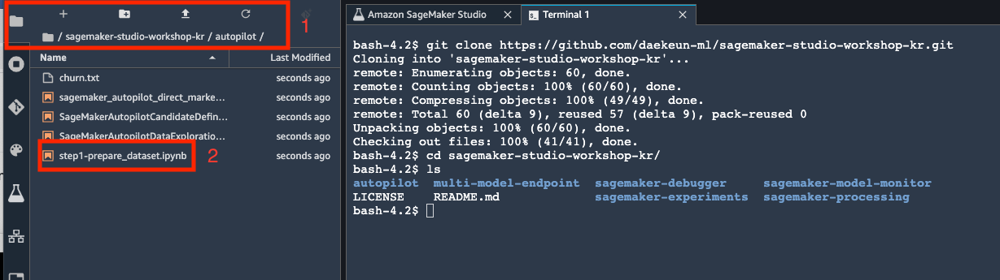
    **<center>Figure 1. 폴더 이동 화면.</center>**    

1. Select Kernel 창이 나온다면 `Figure 2.`과 같이 `Python 3 (Base Python)`을 선택하고 Select 버튼을 클릭합니다. 만약 Select Kernel 창이 먼저 뜨지 않고 곧바로 `Figure 3.`의 화면이 출력된다면, `Figure 3.` 우측 상단의 붉은색 테두리 문자를 클릭해서 Select Kernel 창을 오픈한 다음 kernel을 선택합니다.

    
    **<center>Figure 2. Kernel 선택 화면.</center>**    

    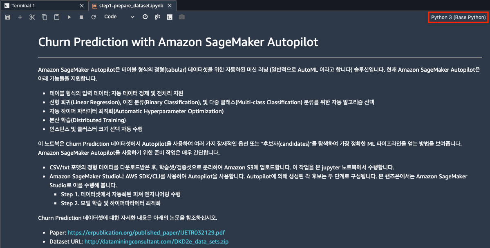
    **<center>Figure 3. step1-prepare-dataset.ipynb Jupyter notebook 화면.</center>**    

1. Jupyter notebook 은 코드와 주석을 같이 저장하며, 두 가지의 Cell(Code Cell 과 Markdown Cell)이 있습니다. Code 를 실행하려면 `Figure 3-1.`을 참조하여 실행 버튼을 클릭하거나, 키보드 단축키
`Control+Enter`나 `Control+Enter`를 실행합니다. 참고로 본 핸즈온 랩은 실제 사용하는 실행 후 셀을 이동하는 `Shift+Enter` 단축키를 권장합니다.

    
    **<center>Figure 3-1. Code Cell 실행 버튼 화면.</center>**    

    1. Code 가 실행되면 Code Cell 왼쪽의 “[ ]” 라는 부분이 “[*]”로 변경이 되고 완료시에는 실행 순서를 나타내는 숫자로 변경됩니다. <br>
    **※ 코드는 Code Cell 에 나타난 순서대로 실행하고 반복 작업을 피하기 위해서 한 번만 실행해 주세요. 동일 cell 을 반복 실행하게 되면 에러가 발생할 수 있습니다.**
        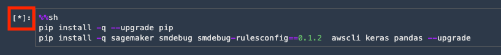
        **<center>Figure 3-2. Code Cell 실행 화면.</center>**    

1. Jupyter notebook 코드의 마지막 Code Cell을 실행하기 전, 아래 예시처럼 bucket을 여러분이 생성한 bucket 이름으로 변경 후 Code Cell을 실행해 주세요.
    ```
    import sagemaker
    bucket = 'sagemaker-studio-gildong' # YOUR OWN BUCKET
    ```

1. 코드가 아래 화면처럼 정상적으로 실행되었는지 확인합니다. 순차적으로 Code Cell을 정상적으로 실행하였다면 Code Cell 왼쪽이 `Figure 3-3.`처럼 [8]이 되어야 합니다.

    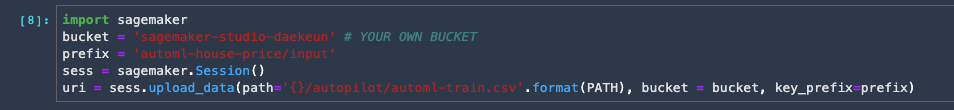
    **<center>Figure 3-3. Code Cell 실행 완료 화면.</center>**    


## Step 2. Autopilot 설정하기
---
데이터가 준비되었다면, 여러분은 One-click으로 Autopilot을 쉽게 시작할 수 있습니다. 이번 step에서 이를 수행해 보겠습니다. 

참고로 본 step은 약 5-10분 소요됩니다.


1. SageMaker Studio 화면의 왼쪽 상단의 아이콘 중 컵 모양의 아이콘 클릭 후, `Create Experiment` 버튼을 클릭합니다. (`Figure 4.` 참조)

    
    **<center>Figure 4. Create Experiment 선택 화면.</center>**    

1. CLI나 API 호출 없이 콘솔 상에서 빠르고 간단하게 Autopilot을 수행해 보겠습니다. 
`Figure 5.`를 참조하여 아래의 지침대로 설정 항목의 값들을 입력해 주세요.

    
    **<center>Figure 5. Autopilot 생성 화면.</center>**   

    - Experiment Name 에서 `autopilot-hol-[YOUR-OWN-NAME]`을 입력하세요.<br>
    (예: `autopilot-hol-gildong`)

    - S3 location of input data 에서 `s3://[YOUR-OWN-BUCKET]/automl-house-price/input/automl-train.csv`을 입력하세요.<br>
    (예: `s3://sagemaker-studio-gildong/automl-house-price/input/automl-train.csv`)

    - Target attribute name 에서 `Churn?`을 입력하세요. 
    - S3 location for output data에서 `s3://[YOUR-OWN-BUCKET]/automl-house-price/output`을 입력하세요.<br>
    (예: `s3://sagemaker-studio-daekeun/automl-house-price/output`)

    - Select the machine learning problem type 에서 `Binary classification`을 선택하세요.

    - Objective metric에서 `F1`을 선택하세요.

    - Do you want to run a complete experiment? 에서 `No, run a pilot to create a notebook with candidate definitions`을 선택하세요. 참고로, `Yes` 선택 시에는 `Create Experiment` 이후 모든 과정이 자동으로 수행되지만, 10개의 candidate 모델을 생성하고 250회의 하이퍼파라메터 최적화 수행으로 약 1시간 30분이 소요되기에 본 핸즈온에는 적합하지 않습니다.<br>
    따라서, 본 핸즈온에서는 빠른 실습을 위해 step 이후 자동으로 생성되는 Jupyter notebook을 수정하여 2개의 candidate 모델과 8회의 하이퍼파라메터 최적화를 수행하겠습니다.

    - 우측 최하단의 `Create Experiment` 버튼을 클릭합니다.

1. `Figure 6.` 처럼 Analyzing Data > Candiate Definitions Generated 를 거쳐 
2개의 Jupyter notebook이 자동으로 생성됩니다. 이 과정은 약 5분 가량 소요됩니다. 만약 5분 경과 후에도 `Figure 7.` 로 넘어가지 않고 `Figure 6.`이 계속 출력된다면 `Figure 6.` 좌측 상단의 붉은색 영역 안의 새로고침 버튼을 클릭하여 작업 완료 여부를 확인합니다.

    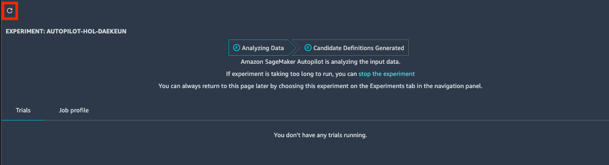
    **<center>Figure 6. Analyzing Data 진행 화면.</center>**   

    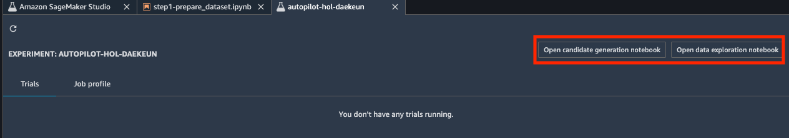
    **<center>Figure 7. Analyzing Data 완료 화면.</center>**   

1. `Figure 7.` 우측 상단에 `Open candidate generation notebook` 버튼과 `Open data exploration notebook` 버튼이 정상적으로 생성되었는지 확인합니다.

<br>

## Step 3. SageMaker Autopilot 체험하기
---
자동으로 생성된 Jupyter 노트북들을 살펴본 후, Candidate generation notebook을 수정하여 피쳐 엔지니어링(Feature Engineering)-모델링(Modeling)-하이퍼파라메터 최적화(Hyperparameter Optimization) 과정을 자동으로 수행해 보겠습니다.

참고로 본 step은 약 30분 소요됩니다.


1. `Figure 7.` 우측 상단에 `Open data exploration notebook`을 클릭하여 Jupyter 노트북을 실행합니다. (`Figure 8.` 참조)<br>
이 노트북 파일은 탐색적 데이터 분석(EDA)을 자동으로 수행한 내역이 저장되어 있으며, 우측 상단의 `Import notebook` 버튼을 클릭 후 노트북 사본을 생성하여 자유롭게 내용 수정이 가능합니다. 

    
    **<center>Figure 8. Data exploration notebook 화면 1.</center>**   

1. 노트북의 Code Cell과 Markdown Cell을 살펴봅니다. Autopilot은 수치형(Numerical) 변수의 cardinality가 낮다면 자동으로 범주형(Categorical) 변수로 간주하는 것을 알 수 있습니다. 참고로 범주형 변수에 대한 전처리도 Autopilot에서 자동으로 수행하기 때문에 별도의 수치 변환 인코딩이나 원핫(One-hot) 인코딩을 수행하실 필요가 없습니다.
    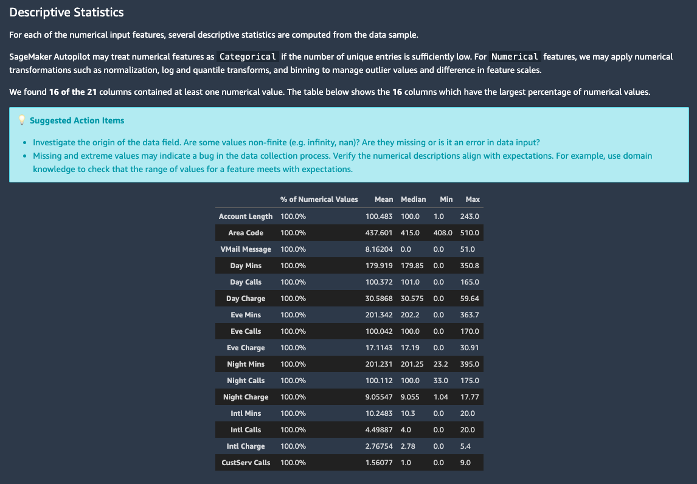
    **<center>Figure 9. Data exploration notebook 화면 2.</center>**   

1. Data exploration 노트북을 모두 살펴보았다면, `Figure 7.` 우측 상단의 `Open candidate generation notebook`을 클릭하여 Jupyter 노트북을 실행합니다. (`Figure 10.` 참조)<br>
이 노트북 파일은 Autopilot을 수행하기 위한 코드가 저장되어 있으며, 우측 상단의 `Import notebook` 버튼을 클릭 후 노트북 사본을 생성하여 자유롭게 내용 수정이 가능합니다. 핸즈온을 위해 우측 상단의 `Import notebook` 버튼을 클릭하여 노트북 사본을 생성합니다. 

1. 참고로, `Step 2.`의 Create Amazon SageMaker Autopilot Experiment 창의 Do you want to run a complete experiment? 에서 `Yes` 선택 시에는 이 노트북 내의 코드들이 자동으로 수행됩니다.

    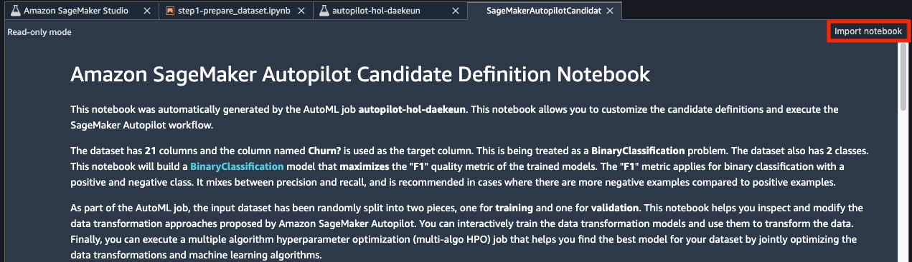
    **<center>Figure 10. Candidate Definition notebook 화면 2.</center>**   

1. Jupyter 노트북 사본을 클릭한 다음, Select Kernel 창에서 `Figure 11.`과 같이 `Python 3 (Base Python)`을 선택하고 Select 버튼을 클릭합니다.

    
    **<center>Figure 11. Kernel 선택 화면.</center>**    

1. Markdown Cell에서 `dpp[0~9중 임의의 숫자]-xgboost`나 `dpp[0~9중 임의의 숫자]-linear-learner`를 찾아 봅니다. 바로 밑의 Code Cell에서 `automl_interactive_runner.select_candidate({...})`가 있어야 합니다. (`Figure 12.` 참조)

    
    **<center>Figure 12. Kernel 선택 화면.</center>**    

1. `dpp[0~9 중 가장 작은 숫자]-xgboost`와 `dpp[0-9중 가장 작은 숫자]-linear-learner`를 제외한 모든 Code Cell을 삭제합니다. (예: `dpp0-xgboost`와 `dpp2-linear-learner`만 미삭제) 
(예: `dpp0-xgboost`, `dpp1-xgboost`, `dpp2-linear-learner`, `dpp3-xgboost`, `dpp4-linear-learner`,.. 중 `dpp0-xgboost`와 `dpp2-linear-learner`를 제외하고 모두 삭제)
<br>
아래 `Figure 13.`은 `dpp3-xgboost` Code Cell을 삭제하는 예시이며, `Edit-Delete Cells (단축키 D,D)`로 삭제하거나 `가위 아이콘`을 클릭하여 Code Cell을 삭제합니다.

    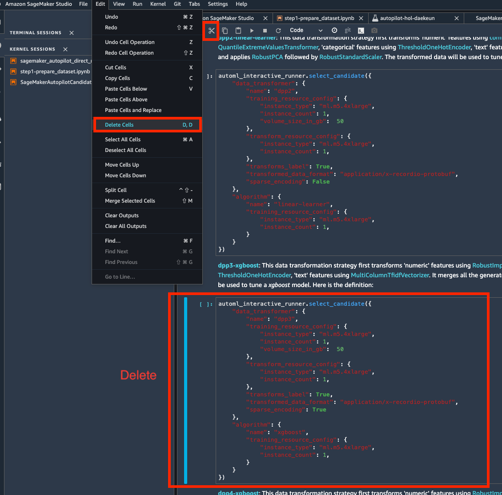
    **<center>Figure 13. Cell 삭제 안내.</center>**    

1. `Selected Candidates`가 표시된 Markdown Cell 다음의 Code Cell에서
`automl_interactive_runner.display_candidates()`을 수행 후, `Figure 14.` 처럼 2개의 행(row)를 리턴하는지 확인합니다.

    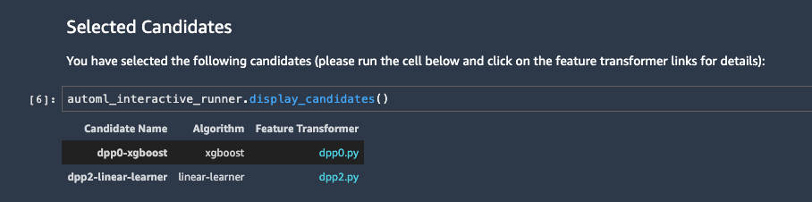
    **<center>Figure 14. Candidates 리스트.</center>**    

1. `Run Data Transformation Steps`가 표시된 Markdown Cell 다음의 Code Cell에서
`automl_interactive_runner.fit_data_transformers(parallel_jobs=[임의의 숫자])`를 실행합니다.
만약 이 Code Cell에서 Resource Limit 오류가 발생한다면 `parallel_jobs=2` 로 수정하여 다시 실행합니다. 참고로, 이 Code Cell을 수행하는 과정은 약 5-6분 가량 소요됩니다.

    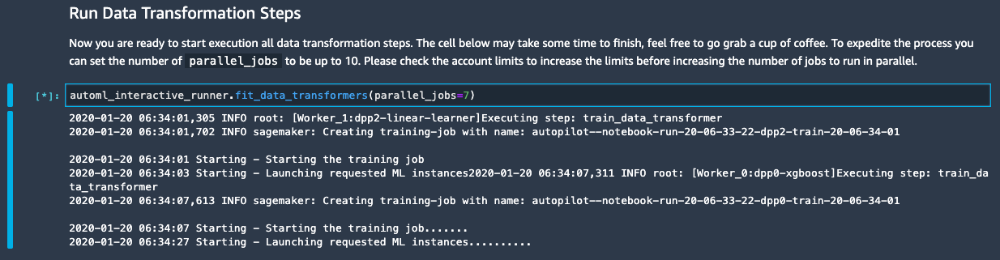
    **<center>Figure 15. Data Transformation 수행.</center>**    

1. `Create Multi-Algorithm Tuner`가 표시된 Markdown Cell 다음의 Code Cell의 `HyperparameterTuner.create(..)` 메소드의 인자값들을 다음과 같이 수정합니다. 
    - `max_parallel_jobs=4` (Resource Limit 오류 발생 시, `max_parallel_jobs=2` 로 수정) 
    - `max_jobs=8` (기존: `max_jobs=250`)
    ```
    # 코드 수정 예시
    tuner = HyperparameterTuner.create(
        base_tuning_job_name=base_tuning_job_name,
        strategy='Bayesian',
        objective_type='Maximize',
        max_parallel_jobs=4,
        max_jobs=8,
        **multi_algo_tuning_parameters,
    )
    ```

    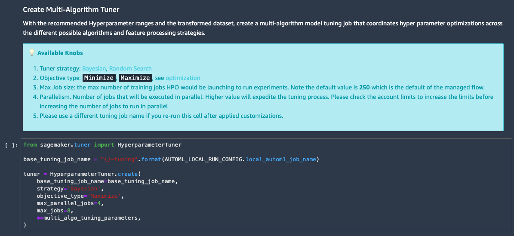
    **<center>Figure 16. 하이퍼파라메터 튜닝 수행 횟수 조정.</center>** 

1. `Run Multi-Algorithm Tuning`이 표시된 Markdown Cell 다음의 Code Cell을 실행합니다. 참고로, 이 Code Cell을 수행하는 과정은 약 7-8분 가량 소요됩니다. (`Figure 17.` 참조)

    
    **<center>Figure 17. 하이퍼파라메터 튜닝.</center>** 

1. (Optional) SageMaker 콘솔 메뉴에서 SageMaker > Hyperparameter tuning jobs'를 선택하여 생성된 하이퍼파라메터 training jobs들을 살펴봅니다. (`Figure 18.` 참조)

    
    **<center>Figure 18. Hyperparameter tuning jobs 확인.</center>**   

<br>

## Step 4. SageMaker Experiment 체험하기 
---
여러분은 데이터셋, 알고리즘, 하이퍼파라메터(hyper-parameters) 및 평가 지표(metrics)들을 포함한 실험의 아티팩트(artifacts)를 SageMaker Experiment로 추적할 수 있습니다. SageMaker Autopilot은 SageMaker Experiment가 포함되어 있기 때문에 별도의 설정 없이 SageMaker Experiment를 쉽게 체험해 보실 수 있습니다.

본 핸즈온랩에서는 하이퍼파라메터 튜닝 시 개별 생성된 Trial들을 쉽게 interactive 툴로 visualize하는 방법을 수행해 보겠습니다.

참고로 본 step은 약 5-10분 소요됩니다.

1. Code Cell 왼쪽의 “[*]” 라는 부분이 숫자로 변경되면 좌측의 플라스크 아이콘을 클릭 후, 
`Unassigned trial components`에 마우스 커서를 위치하고 오른쪽 버튼을 클릭하여 `Open in trial component list`를 선택합니다. (`Figure 19.` 참조)

    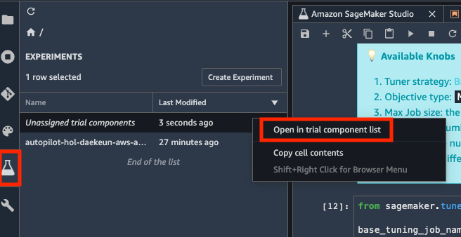
    **<center>Figure 19. Trial component list 열기.</center>**   

1. 가장 최근에 생성된 Training job 8개(ObjectiveMetric이 존재하는 job들)를 복수 선택하여(Shift+마우스 왼쪽 버튼을 클릭하면 편리합니다.) 마우스 오른쪽 버튼 클릭 후, `Open in trial details`를 선택합니다. (`Figure 20.` 참조)

    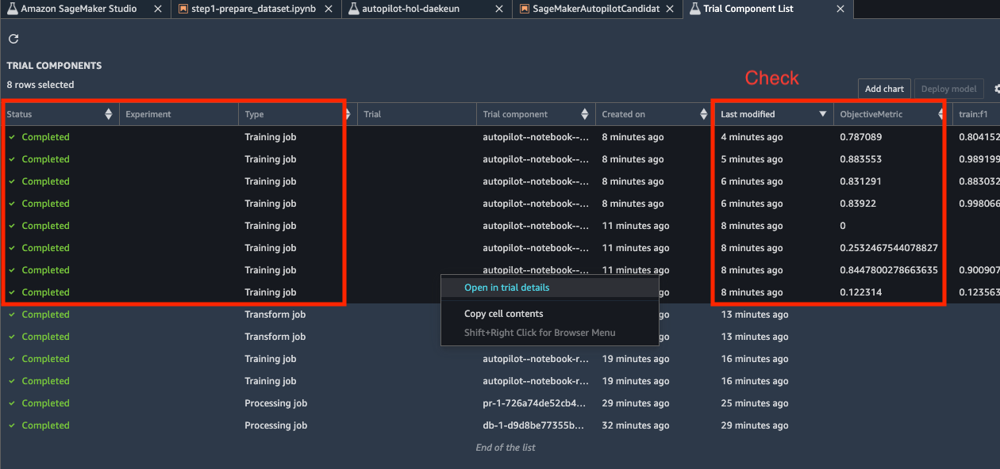
    **<center>Figure 20. Trial 선택.</center>**  


1. Trial Component들을 산점도 차트(Scatter plot)로 시각화해 보겠습니다.  <br>
`TRIAL COMPONENTS` 우측의 `Add Chart` 버튼을 클릭하여 차트를 추가합니다.
`Figure 21.`를 참조하여 아래의 지침대로 설정 항목의 값들을 입력해 주세요.

    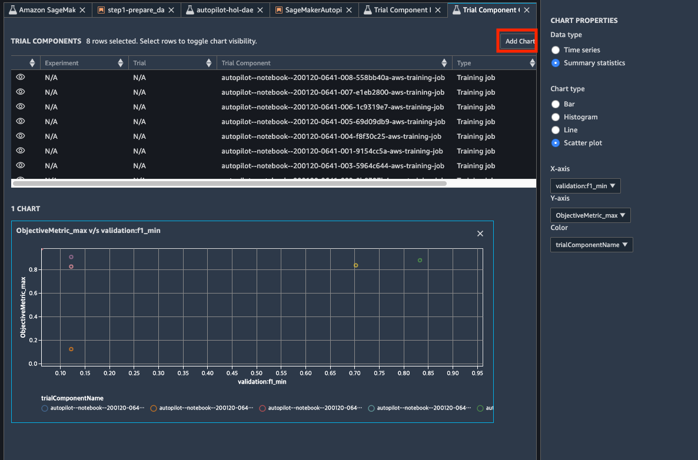
    **<center>Figure 21. 차트 추가.</center>**   

    - Data type: `Summary statistics`
    - Chart type: `Scatter plot`
    - X-axis: `validation:f1_min`
    - Y-axis: `ObjectiveMetric_max`
    - Color: `trialComponentName`

1. Trial Component들을 히스토그램 바(Histogram Bar)로 시각화해 보겠습니다. 하이퍼파라메티
튜닝 결과가 검증데이터 상에서 검증을 수행했을 때 주로 어느 range에 몰리는 지 쉽게 확인하기 위한 목적입니다.<br>
`TRIAL COMPONENTS` 우측의 `Add Chart` 버튼을 클릭하여 차트를 추가합니다.
`Figure 22.`를 참조하여 아래의 지침대로 설정 항목의 값들을 입력해 주세요.

    
    **<center>Figure 22. 차트 추가.</center>**   

    - Data type: `Time series`
    - Chart type: `Histogram`
    - X-axis dimension: `Time`
    - X-axis aggregation: `1-minute`
    - X-axis:: `ObjectiveMetric_max`

1. 위의 과정와 유사한 방법으로 자유롭게 차트를 직접 추가해 보세요.

## Optional Step. 모델 배포 및 SageMaker Model Monitor 체험하기
---
본 step은 10분 가량의 추가 시간이 요구되며, 필수 항목은 아닙니다.
핸즈온랩에 여유 시간이 있을 때만 수행하시면 됩니다. 

1. Candidate generation notebook의 마지막 Code Cell을 실행합니다. 해당 Cell의 코드는
`pipeline_model.deploy(...)`이며, 모델 실시간 배포에 필요한 Endpoint를 생성하므로 수행 시간은 약 5~10분 소요됩니다. (`Figure 23.` 참조) <br>
또한, SageMaker Autopilot은 이 과정에서 Model Monitor Jupyter 노트북도 자동으로 생성합니다. 

    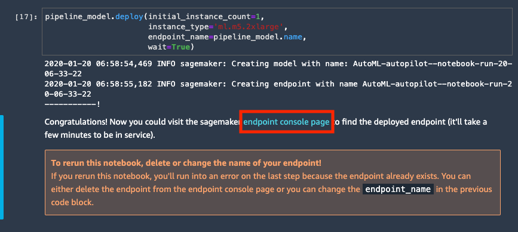
    **<center>Figure 23. Endpoint 생성.</center>**  

1. 마지막 Markdown Cell의 `endpoint console page`를 클릭하여(`Figure 23.`의 빨간색 테두리 참조) Amazon SageMaker 콘솔 화면으로 이동합니다.
`Figure 24.`의 화면에서 Endpoint가 생성된 것을 확인하실 수 있습니다.

    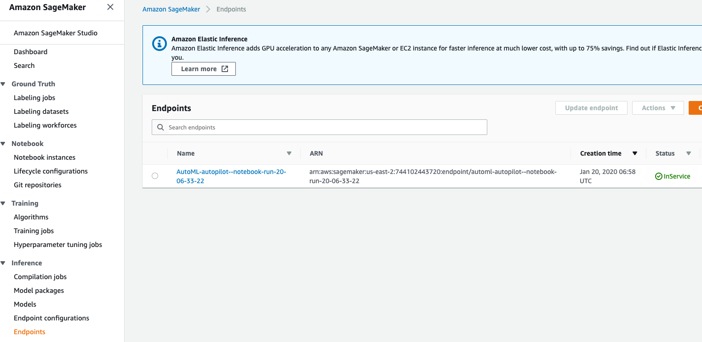
    **<center>Figure 24. Endpoint 생성 확인.</center>**  

1. 마지막 Markdown Cell의 `endpoint console page`를 클릭하여(`Figure 23.`의 빨간색 테두리 참조) Amazon SageMaker 콘솔 화면으로 이동합니다.
`Figure 24.`의 화면에서 Endpoint가 생성된 것을 확인하실 수 있습니다.

    
    **<center>Figure 24. Endpoint 생성 확인.</center>**  

1. 좌측의 아이콘들 중 아래에서 2번째 아이콘을 클릭 후, `AutoML-autopilot--..` endpoint를 클릭하여 자동으로 생성된 SageMaker Model Monitor Jupyter 노트북을 확인합니다. (`Figure 25.` 참조)

    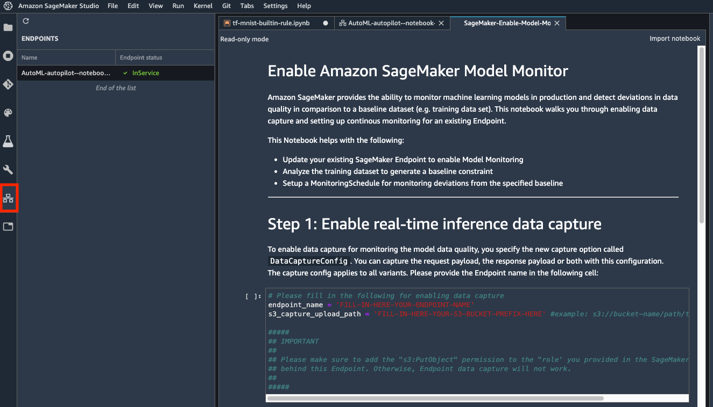
    **<center>Figure 25. SageMaker Model Monitor Jupyter 노트북 화면.</center>**  

수고하셨습니다. 이상으로 본 모듈의 실습 과정을 마무리 하셨습니다. 워크샵 이후 발생되는
비용을 방지하기 위해 서비스 종료 가이드를 통해 사용하신 리소스들을 모두 종료/삭제 해주십시오.    

