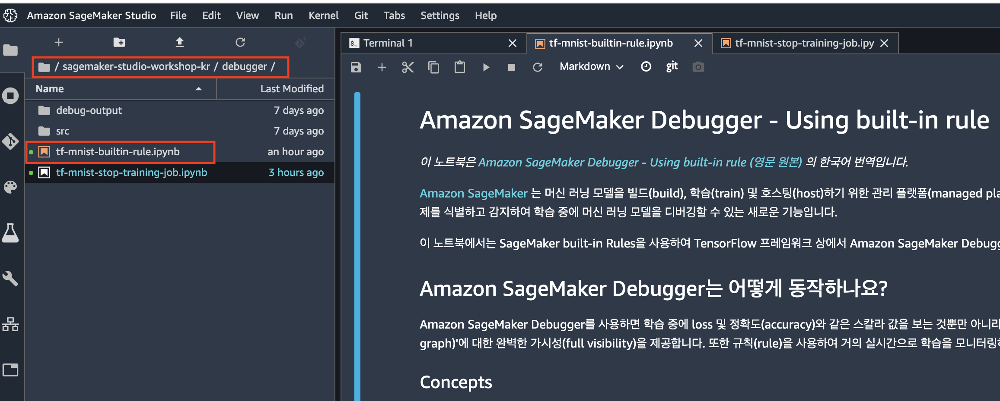
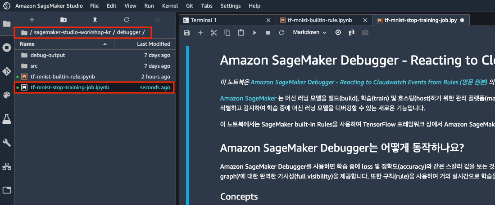

# Module 3. Amazon SageMaker Debugger

Amazon SageMaker Debugger는 학습 과정을 지속적으로 모니터링하여 지정된 Rule에 따라 vanishing gradient, 부적절한 weight 초기화, loss 미감소 등과 같은 이상치들을 감지합니다. 
이 모듈에서는 Amazon SageMaker Debugger의 기본 사용법을 MNIST dataset과 TensorFlow 프레임워크로 실습해 보겠습니다. 여러분은 본 실습을 통해 아래 사항들을 다루게 됩니다.
- Debugger Hook Config 설정법 
- SageMaker built-in Rules 사용법
- (Optional & Advanced) Cloudwatch Events for Rules 

참고로, 본 모듈의 실습 시간은 약 30분이 소요됩니다. (Optinoal Step까지 수행 시는 약 50분이 소요됩니다.)

### 목차
- Step 1. Amazon SageMaker Debugger 개요
- Step 2. Amazon SageMaker Debugger 체험하기
- Optional Step. Cloudwatch Events for Rules

 

## Step 1. Amazon SageMaker Debugger 개요
---
### Concepts
본 실습에 들어가기 전에, Amazon SageMaker Debugger의 주요 컨셉을 살펴보도록 하겠습니다.

- **Tensors(텐서)**: 학습 중 중간 지점(intermediate points)의 네트워크 상태를 나타냅니다.
- **Debug Hook(디버그 후크)**: Hook는 Amazon SageMaker Debugger가 학습 프로세스를 살펴보고 원하는 step 간격으로 요청된 텐서를 캡처합니다.
일부 프레임워크 컨테이너(TensorFlow 1.15, MXNet 1.6, PyTorch 1.3, XGBoost >= 0.90)들은 학습 스크립트 변경 없이 곧바로 Debugger가 활성화되며(`src/mnist_zerocodechange.py` 참조), 
다른 컨테이너의 경우 텐서 캡처 및 분석에 필요한 라이브러리 `smdebug`를 설치하고 학습 스크립트에 후크 콜백 함수를 추가하여 Debugger를 활성화할 수 있습니다(`src/mnist_byoc.py` 참조).
참고로, 본 워크샵에서는 학습 스크립트 변경이 필요 없는 TensorFlow 1.15를 사용합니다.
- **Rule(규칙)**: S3에 Hook로 캡처된 텐서를 가져와서 분석 후 이상점들(anomalies)이 발견되면 예외를 발생시키고 Amazon CloudWatch 이벤트를 트리거합니다. 여러 Rule들을 동시에 실행할 수 있습니다. 
빌트인(Built-in) Rule들은 2020년 2월 1일 기준 18개를 제공하고 있으며, 저장할 텐서/텐서 구성 방법 및 사용할 사용자 정의 Rule을 구성할 수 있는 고급 모드도 지원합니다.

자세한 내용은 [Debugger Guide](https://github.com/awslabs/sagemaker-debugger/tree/master/docs)를 참조하세요.

## Step 2.  Amazon SageMaker Debugger 체험하기
---
실습을 위해서 현재 설치되어 있는 SageMaker 의 Jupyter 노트북의 예제들 중 아래의 디렉토리에 위한 Jupyter 노트북을 실행하시면 됩니다. 
`/sagemaker-studio-workshop-kr/debugger/tf-mnist-builtin-rule.ipynb`

**
Figure 1. Juypyter notebook 예제 코드.
**    

본 step의 실습 시간은 약 20분이 소요됩니다.

참고로, Code cell을 실행하려면 `Figure 1.`을 참조하여 실행 버튼을 클릭하거나, 키보드 단축키
`Control+Enter`나 `Shift+Enter`를 실행합니다. 참고로 본 핸즈온 랩은 실제 사용하는 실행 후 Cell을 이동하는 `Shift+Enter` 단축키를 권장합니다.

**
Figure 2. Code cell 실행 화면.
** 

## Optional Step. Cloudwatch Events for Rules
---
본 step은 약 20분의 추가 실습 시간이 요구되며, 필수 항목은 아닙니다. 
실습을 위해서 현재 설치되어 있는 SageMaker 의 Jupyter 노트북의 예제들 중 아래의 디렉토리에 위한 Jupyter 노트북을 실행하시면 됩니다. 
`/sagemaker-studio-workshop-kr/debugger/tf-mnist-stop-training-job.ipynb`

**
Figure 3. Juypyter notebook 예제 코드.
**    

수고하셨습니다. 이상으로 본 모듈의 실습 과정을 마무리 하셨습니다. 워크샵 이후 발생되는
비용을 방지하기 위해 서비스 종료 가이드를 통해 사용하신 리소스들을 모두 종료/삭제 해주십시오.
