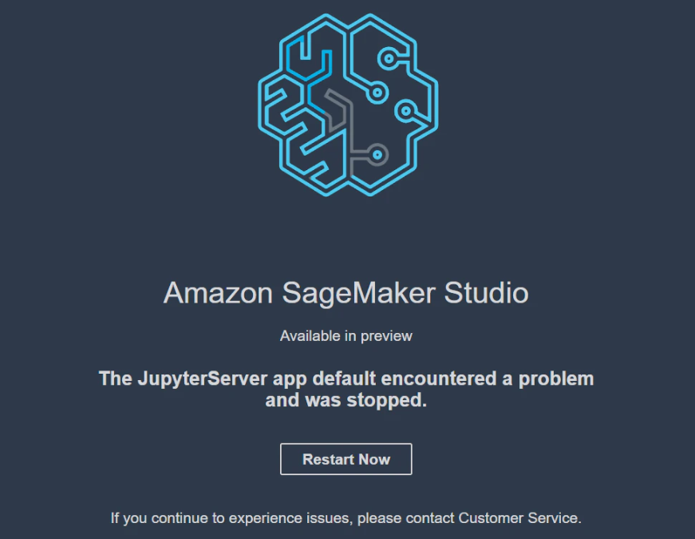

# FAQ. Amazon SageMaker Studio 리소스 제거 

***[주의!] Event Engine으로 생성한 임시 AWS 계정이 아닌 여러분의 계정으로 본 워크샵을 실습한다면, 워크샵 이후 아래 지침을 따라 리소스를 직접 삭제해 주셔야 합니다.***

Amazon SageMaker Studio Preview(2020년 2월 1일 기준)에서는 현재 AWS 콘솔에서 SageMaker Studio와 domain에 대한 사용자 프로필을 직접 삭제할 수 없습니다.
또한, 간헐적으로 `Figure 1.` 처럼 JupyterServer app이 죽는 경우가 있어서 이 경우에도 삭제가 필요합니다.<br>
따라서, 본 문서에서 AWS CLI(Command-line Interface)로 이를 삭제하는 법에 대해 안내 드리겠습니다.


**<center>Figure 1. JupyterServer app 에러 화면.</center>**    

## Domain 관련 응용 프로그램 확인 및 제거

아래 CLI로 응용 프로그램의 유무를 확인합니다.
```
$ aws sagemaker list-apps --region us-east-2
```

출력 예시
```
{
    "Apps": [
        {
            "DomainId": "d-dt4cmt1evrhr",
            "UserProfileName": "daekeun-recap",
            "AppType": "KernelGateway",
            "AppName": "base-python",
            "Status": "InService",
            "CreationTime": 1580794908.734
        },
        {
            "DomainId": "d-dt4cmt1evrhr",
            "UserProfileName": "daekeun-recap",
            "AppType": "JupyterServer",
            "AppName": "default",
            "Status": "InService",
            "CreationTime": 1580794769.035
        }
    ]
}
```

만약 위의 출력 예시처럼 응용 프로그램이 존재하면 아래 CLI로 응용 프로그램을 제거합니다.
```shell
$ aws --region us-east-2 sagemaker delete-app --domain-id [YOUR-DOMAIN-ID] --user-profile [YOUR-USER-PROFILE] --app-type [YOUR-APP-TYPE] --app-name [YOUR-APP-NAME]
```

입력 예시
```shell
$ aws --region us-east-2 sagemaker delete-app --domain-id d-dt4cmt1evrhr --user-profile daekeun-recap --app-type KernelGateway --app-name default
```

## Domain에 대한 사용자 프로필 삭제

아래 CLI로 사용자 프로필의 유무를 확인합니다. 참고로, 사용자 프로필음 AWS 콘솔에서도 확인하실 수 있습니다.
```shell
$ aws --region us-east-2 sagemaker list-user-profiles
```

출력 예시
```
{
    "UserProfiles": [
        {
            "DomainId": "d-dt4cmt1evrhr",
            "UserProfileName": "daekeun-recap",
            "Status": "InService",
            "CreationTime": 1575955115.627,
            "LastModifiedTime": 1575955117.617
        }
    ]
}
```

만약 위의 출력 예시처럼 사용자 프로필이 존재하면 아래 CLI로 응용 프로그램을 제거합니다.
```shell
$ aws --region us-east-2 sagemaker delete-user-profile --domain-id [YOUR-DOMAIN-ID] --user-profile [YOUR-USER-PROFILE]
```

입력 예시
```shell
$ aws --region us-east-2 sagemaker delete-user-profile --domain-id d-dt4cmt1evrhr --user-profile daekeun-recap
```

## Amazon SageMaker Studio 삭제
사용자 프로필 삭제 완료 후, 아래 CLI로 Amazon SageMaker Studio를 삭제하시면 됩니다.

```shell
$ aws --region us-east-2 sagemaker delete-domain --domain-id [YOUR-DOMAIN-ID]
```

입력 예시
```shell
$ aws --region us-east-2 sagemaker delete-domain --domain-id d-dt4cmt1evrhr
```
