# Module 1. Getting Started with SageMaker Studio

이 모듈에서는 SageMaker Studio IDE(Integrated Development Environment)를 시작해 봅니다. 실습 시간은 약 10분 소요됩니다.

1. AWS [관리 콘솔](https://console.aws.amazon.com/console/home)에 Sign in 합니다. 만약 AWS 측에서 Event Engine을 사용하여 임시 아이디를 생성한 경우, 제공 받으신 URL을 여시고 Team Hash code를 입력하시면 됩니다.

1. 리전(Region)이 `Ohio`로 되어 있는지 확인합니다. 만약 다른 리전으로 설정되어 있다면, `Ohio`로 변경해 주세요. (`Figure 1.` 참조)

    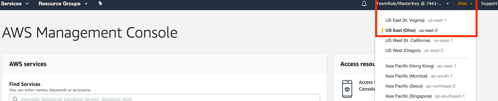
    **
Figure 1. 리전 확인.
**    

1. Amazon SageMaker Studio로 접속합니다. 좌측 메뉴에서 Amazon SageMaker Studio를 클릭하거나, 우측의 Launch Amazon SageMaker Studio를 클릭하세요. (`Figure 2.` 참조)

    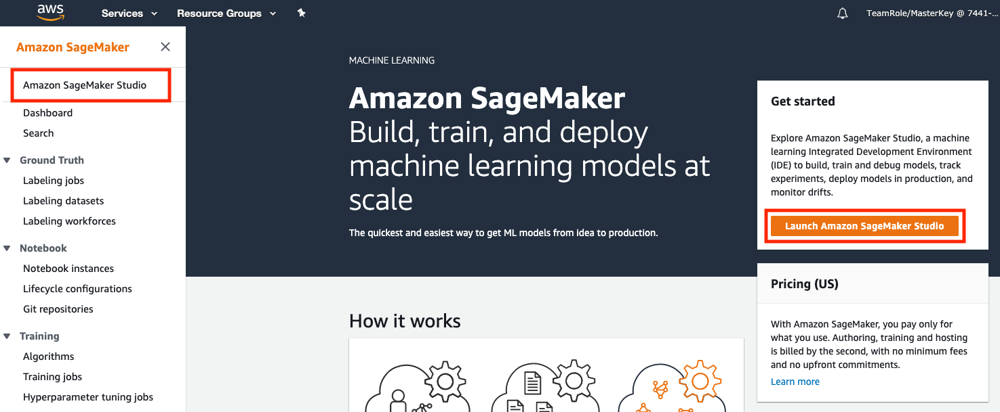
    **
Figure 2. Amazon SageMaker Studio 메뉴 이동.
**     

1. Figure 3.을 참조하여 `Start with IAM`을 클릭하세요. 참고로, SSO(Single Sign-On)으로 AWS 콘솔 접근 없이 곧바로 Amazon SageMaker Studio에 접속 가능하지만, 본 핸즈온에서는 원활한 실습을 위해 IAM(Identity and Access Management)으로 실습하겠습니다.

    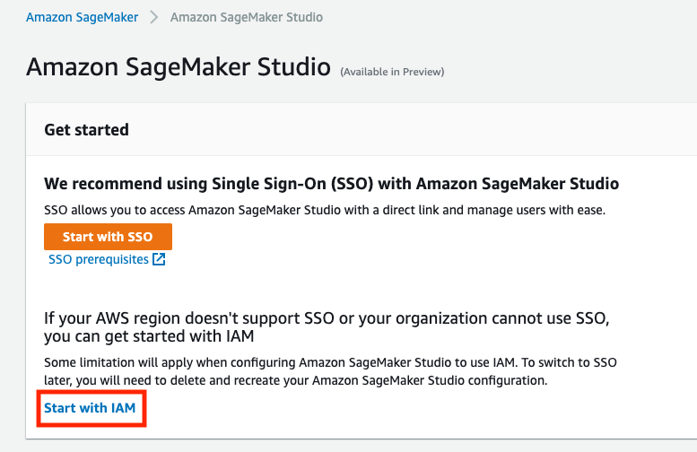
    **
Figure 3. Start with IAM.
**    
 
1. Permission 항목의 Execution role for all users에서 `Figure 4.`처럼 `Create a new role`을 선택하고, 생성된 팝업 창에서는 `Figure 5.`처럼 S3 buckets you specify – optional 밑에 `Any S3 Bucket` 을 선택합니다. 이후 팝업 창 우측 하단의 `Create role` 버튼을 클릭합니다.
    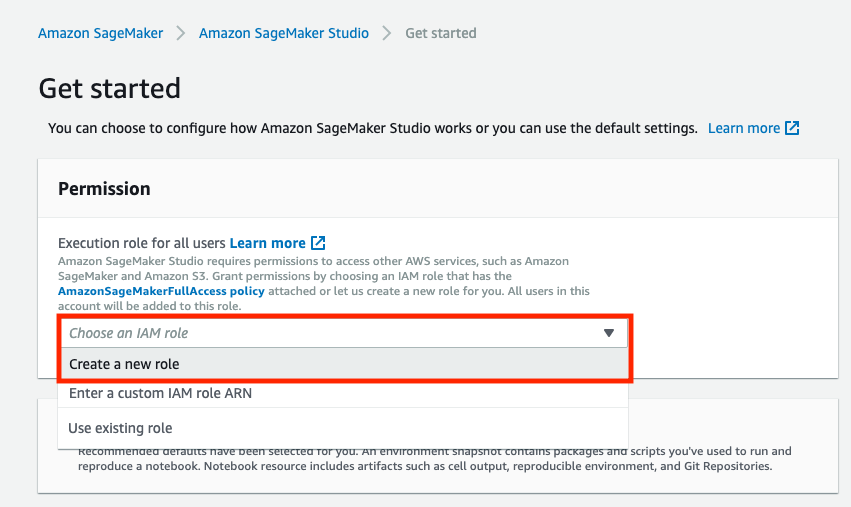

    **
Figure 4. Execution role.
**  

    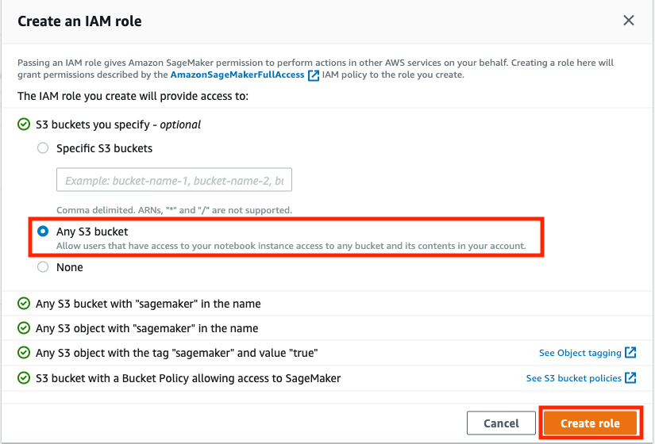
    **
Figure 5. Role 추가.
**    

1. S3 buckets you specify – optional 을 클릭 후, Shareable notebook resource에서 Enable notebook resource sharing이 활성화되었는지 확인하고, S3 location for sharable notebook resource에 `s3://sagemaker-studio-[YOUR-OWN-NAME]/sharing`을 입력합니다. (`Figure 6.` 참조)

    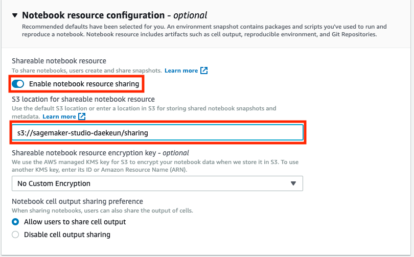
    **
Figure 6. S3 bucket 설정.
**    
 

1. Amazon SageMaker Studio 화면의 Summary 항목에서 domain ID가 정상적으로 생성되었는지 확인하고, Status가 `Pending`에서 `InService`로 변경될 때까지 기다립니다(약 4~5분 소요). 이후 `Figure 7.` 처럼 `InService`로 변경되었다면 Profile management를 클릭 후, `Add user profile` 버튼을 클릭합니다.

    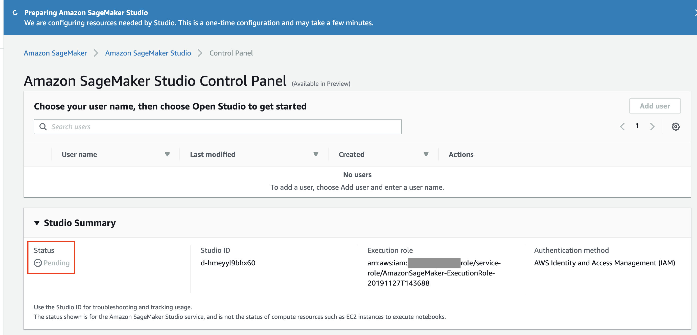
    **
Figure 7. Domain ID 생성.
**    

1. `Figure 8.`처럼 User profile의 User profile name 입력란에 `[YOUR-OWN-NAME]`(예: gildong)을 입력 후, `Submit` 버튼을 클릭합니다.

    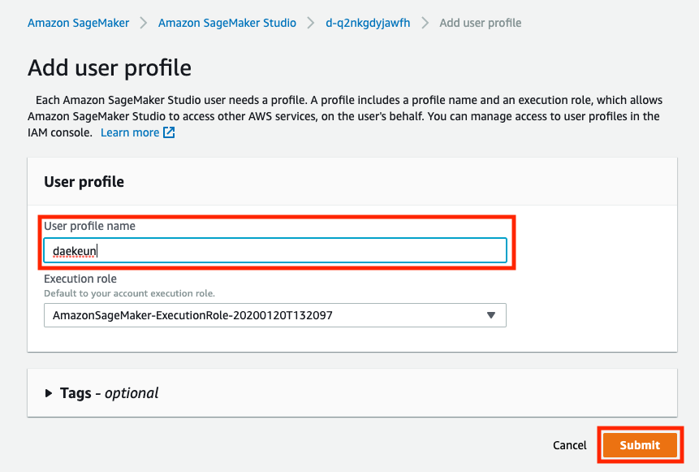
    **
Figure 8. Add user profile.
**    

1. Amazon SageMaker Studio 화면에서 `User profile`을 클릭 후, 생성한 User profile의 라디오버튼이 선택되었는지 확인 후, `Open Amazon SageMaker Studio` 버튼을 클릭합니다.

    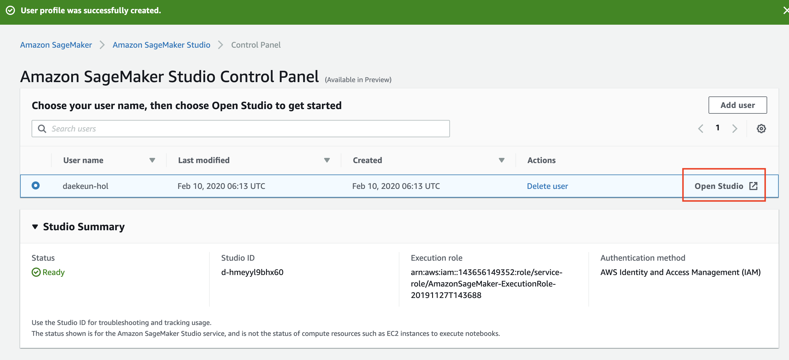
    **
Figure 9. Open Amazon SageMaker Studio.
**    

1. `Figure 10.`의 화면이 출력되면서 JupyterServer를 로딩합니다. 이 과정은 평균적으로 약 2-3분 소요됩니다. 만약 5분 경과 이후에도 `Figure 11.`의 화면으로 넘어가지 않으면, 핸즈온랩 진행자나 서포터들에게 문의해 주세요.

    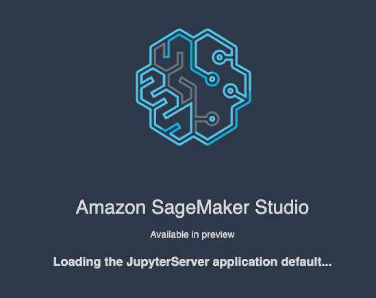
    **
Figure 10. Amazon SageMaker Studio 시작.
**    

    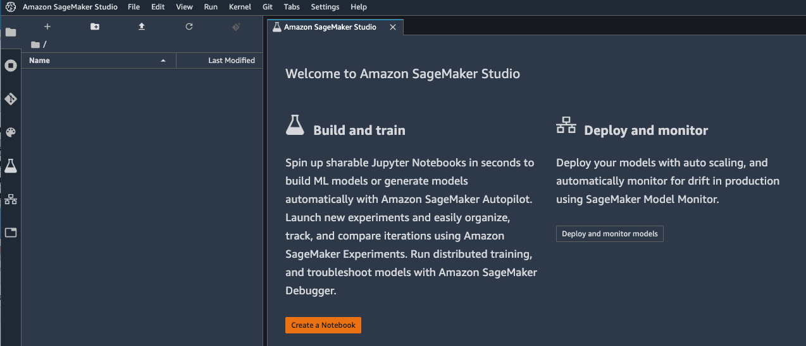
    **
Figure 11. Amazon SageMaker Studio 초기 화면.
**    

수고하셨습니다. 모듈 1을 완료하였습니다.